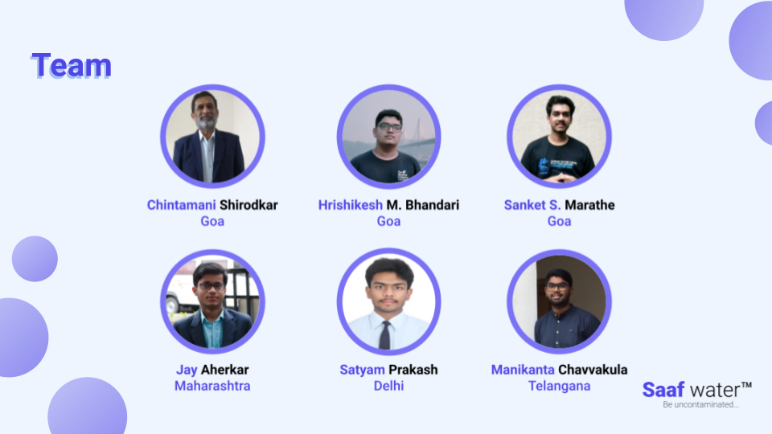

# Saaf water 

  

## Contents

- [Submission or project name](#submission-or-project-name)
  - [Contents](#contents)
  - [Short description](#short-description)
    - [What's the problem?](#whats-the-problem)
    - [How can technology help?](#how-can-technology-help)
    - [The idea](#the-idea)
  - [Demo video](#demo-video)
  - [The architecture](#the-architecture)
  - [Long description](#long-description)
  - [Project roadmap](#project-roadmap)
  - [Getting started](#getting-started)
  - [Live demo](#live-demo)
  - [Built with](#built-with)
  - [Contributing](#contributing)
  - [Team](#team)
  - [License](#license)
  - [Acknowledgments](#acknowledgments)

## Short description

### What's the problem?

Are you aware that almost 50% of the world’s population, including that of developed countries, is dependent on groundwater for drinking? 

Physical, Chemical, and Biological Contamination of groundwater have led to <em> 1 in 3 people globally not having access to safe drinking water, this is as per UNICEF and WHO report of 2019 </em>. Consumption of contaminated water leads to numerous health complications from dysentery to severe kidney damage.
The biggest problem is the lack of frequent monitoring and its communication about the Degradation of a Water source not just to the authorities but to the community too.  

### How can technology help?

With IoT devices, frequent water quality monitoring becomes automated and thanks to open-source web technologies, this information can be made accessible to every individual who is using a water source. Integration of IBM Cloud and Watson services enables us to not just inform about the degraded groundwater source but also informs the community about the purification methods whenever required. Understanding patterns from collected Data can be employed to reduce lab test dependency for approximate assessment. 

### The idea

Saaf water is an end to end Open-source platform which when installed will:
1. Timely monitors groundwater and informs authorities as well as the community about water quality along with purification methods for consumption.
2. Predict when the water quality will go bad.
3. Reduce dependency on manual test kits or lab tests for approximate assessment.

## Demo video

## The architecture

1. The Saaf water hardware consists of a low power, cellular enabled setup that monitors water parameters and sends it to IBM watson IoT platform via MQTT.
2. The Node-RED backend IBM Cloud collects these parameters via MQTT for water quality estimation.
3. Once estimation is done it stores the complete data instance on Cloudant NoSQL database and also sends the water quality information to the hardware via MQTT for visual indication.
4. In case the water quality is Bad or Worse the Node-RED backend sends a text message to the subscribed users via Twilio (Since we are on free plan, subscription is limited to manual contact entry).
5. The Node-RED backend sets up a WebSocket service for the data transmission to the Saaf water Dashboard.
6. The Saaf water Dashboard then displays the data in number, chart, table, calendar heatmap, map and summary for water quality estimation, purification methods and usage info.
7. In case the hardware disconnects from the internet it is capable to approximately assess the water quality and display through the visual indicators (LED Ring).

## Long description

[More detail is available here](./docs/DESCRIPTION.md)

## Project roadmap

> **Note: Some things may take longer time because of COVID-19 restrictions in India.**

The Saaf water currently does the following things.

- Monitors various groundwater parameters.
- Estimates groundwater quality and purification methods.
- Informs all the subscribed users via SMS, Onsite visual indicators and Saaf water Dashboard.

Features Pending - 

- Switching over to ML predictions for Water quality and purification methods once data collection is complete.
- Translation of the entire Saaf water platform from SMS to Saaf water Dashboard.
- Rapid visual biological tests.
- Seasonal Groundwater quality predictions.

 

## Getting started

To get started with Saaf water platform - visit respective section below:

- [Saaf water Hardware](./hardware/)
- [Saaf water Backend](./backend/)
- [Saaf water Dashboard](./frontend/)
 
*OR*
 
To contribute do consider individual repositories in [Saaf water](https://github.com/saaf-water) organization.

## Live demo

You can find a running system to test at [saaf-water.eu-gb.mybluemix.net](https://saaf-water.eu-gb.mybluemix.net/)

## Built with

- [IBM Node Red](https://nodered.org/docs/getting-started/ibmcloud#deploy-to-ibm-cloud) - Backend for saaf-Water
- [IBM Watson IoT Platform](https://www.ibm.com/cloud/watson-iot-platform) - IoT Gateway on IBM Cloud
- [IBM Cloudant](https://www.ibm.com/cloud/cloudant) - NoSQL database for historical data
- [IBM Cloud Foundry](https://www.ibm.com/cloud/cloud-foundry) - To deploy [Saaf water Dashboard](https://saaf-water.eu-gb.mybluemix.net/)
- [Esri Arcgis Map](https://www.esri.com/en-us/arcgis/about-arcgis/overview) - For maps in [Saaf water Dashboard](https://saaf-water.eu-gb.mybluemix.net/)
- [ReactJs](https://reactjs.org/) - Front-End framework

## Contributing

Please read [CONTRIBUTING.md](CONTRIBUTING.md) for details on our code of conduct, and the process for submitting pull requests to us.

## Team

- [Hrishikesh Bhandari](https://github.com/Hrishikesh24)
- [Jay Aherkar](https://github.com/jehhhh)
- [Satyam Prakash](https://github.com/satyamprakash-iot)
- [Manikanta Chavvakula](https://github.com/ManikantaChavvakula7)
- [Sanket Marathe](https://github.com/msanket9)

## License

This project is licensed under the Apache 2 License - see the [LICENSE](LICENSE) file for details.

## Acknowledgments

- We acknowledge the support and guidance of Mr. Chintamani Shirodkar.
- Based on [Billie Thompson's README template](https://gist.github.com/PurpleBooth/109311bb0361f32d87a2).
