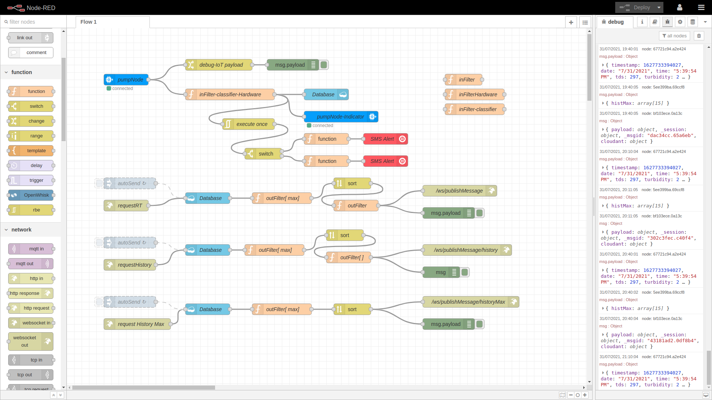

# Saaf water Backend

 

### Getting started with Saaf water Hardware

Note: Setup IBM Cloudant NoSQL DB, Node-RED on IBM Cloud, configure IBM IoT Platform and Twillio

1. Import the [Node-RED flow](./Node-RED)
2. Configure all the information
3. Deploy!

### How to Contribute

Thank you for your interest in contributing to Saaf water! Before you begin writing code, it is important that you share your intention to contribute with the team, based on the type of contribution:

1.  You want to propose a new feature and implement it.
    -   Post about your intended feature in an [issue](https://github.com/saaf-water/Saaf-water-Backend/issues), and we shall discuss the design and implementation. Once we agree that the plan looks good, go ahead and implement it.
2.  You want to implement a feature or bug-fix for an outstanding issue.
    -   Search for your issue in the [Saaf water Backend issue list](https://github.com/saaf-water/Saaf-water-Backend/issues).
    -   Pick an issue and comment that you'd like to work on the feature or bug-fix.
    -   If you need more context on a particular issue, please ask and we shall provide.

Once you implement and test your feature or bug-fix, please submit a Pull Request to [https://github.com/saaf-water/Saaf-water-Backend](https://github.com/saaf-water/Saaf-water-Backend).

The project reviewers at this time are :

- [Hrishikesh Bhandari](https://github.com/Hrishikesh24) (Maintainer)

## License

Saaf water Dashboard is licensed under the Apache Software License, Version 2.
Contributions are subject to the [Apache Software License, Version 2](http://www.apache.org/licenses/LICENSE-2.0.txt).
