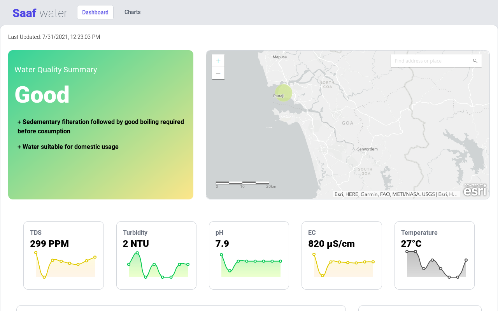

# Saaf water Dashboard

 

## Getting Started with Saaf water Dashboard (React App)

Saaf water Dashboard (React App) is the front-end for the entire Saaf water platform. Built with:

- [ReactJS](https://reactjs.org/)
- [react-chartjs-2](https://www.npmjs.com/package/react-chartjs-2)
- [Esri ArcGis Map](https://www.esri.com/en-us/arcgis/about-arcgis/overview)
- [Tailwind CSS](https://tailwindcss.com/)
- [Node.Js](https://nodejs.org/en/)

Instructions to run the Saaf water Dashboard (React App);
1. [Local Development](#run-the-saaf-water-dashboard-for-local-development)
2. [IBM Cloud](#run-the-saaf-water-dashboard-on-ibm-cloud-for-free)

### Run the Saaf water Dashboard for local development
#### Pre-requisites
1. [Install Node and NPM](https://nodejs.org/en/download/)

#### Install npm packages
- Start a terminal/CMD in `~/Dashboard/` directory.
- Execute command `npm install`.

#### Run the App
- Execute command `npm start`.
- Open a web browser and enter `http://localhost:3000`.

### Run the Saaf water Dashboard on IBM Cloud for Free
#### Pre-requisites
1. IBM Cloud Account:
    - [Create free IBM Cloud account with $200 USD in credits](https://developer.ibm.com/callforcode/get-started/)
2. [Install Node and NPM](https://nodejs.org/en/download/)

#### Build the App for production
- Start a terminal/CMD in `~/Dashboard/` directory.
- Execute command `npm install` and `npm run build`.

A production ready app's build folder with all dependencies will be created in the `~/Dashboard/build` directory.

#### Deploy the App on IBM Cloud

The App can deployed on IBM Cloud for free with following two free services;
1. [IBM Cloud Foundry](./docs/IBM_CLOUD_FOUNDRY_DEPLOYMENT.md)

### How to Contribute

Thank you for your interest in contributing to saaf-water! Before you begin writing code, it is important that you share your intention to contribute with the team, based on the type of contribution:

1.  You want to propose a new feature and implement it.
    -   Post about your intended feature in an [issue](https://github.com/saaf-water/Dashboard/issues), and we shall discuss the design and implementation. Once we agree that the plan looks good, go ahead and implement it.
2.  You want to implement a feature or bug-fix for an outstanding issue.
    -   Search for your issue in the [saaf-water Dashboard issue list](https://github.com/saaf-water/Dashboard/issues).
    -   Pick an issue and comment that you'd like to work on the feature or bug-fix.
    -   If you need more context on a particular issue, please ask and we shall provide.

Once you implement and test your feature or bug-fix, please submit a Pull Request to [https://github.com/saaf-water/Dashboard](https://github.com/saaf-water/Dashboard).

The project reviewers at this time are :

- [Sanket Marathe](https://github.com/msanket9) (Maintainer)
- [Hrishikesh Bhandari](https://github.com/Hrishikesh24)
- [Manikanta Chavvakula](https://github.com/ManikantaChavvakula7)
- [Jay Aherkar](https://github.com/jehhhh) 

## License

Saaf water Dashboard is licensed under the Apache Software License, Version 2.
Contributions are subject to the [Apache Software License, Version 2](http://www.apache.org/licenses/LICENSE-2.0.txt).

