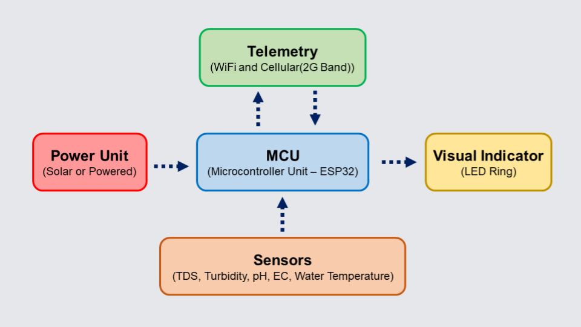

# Saaf water Hardware

 

Saaf water hardware collects data, displays water quality and estimates or sends data to IBM Watson IoT Platform via MQTT Protocol. 
To do so it comprises of 5 units namely:
- Power Unit 
    - 1000 mAh LiPo Battery
    - 5V 1A DC Power Adapter or equivalent Solar Panel
- Microcontroller Unit (MCU) 
    - [ESP32 Dev Module](https://www.espressif.com/sites/default/files/documentation/esp32-wroom-32e_esp32-wroom-32ue_datasheet_en.pdf)
    - [ADS1115 External ADC](https://www.adafruit.com/product/1085)
- Sensing Unit
    - [TDS Senor](https://wiki.seeedstudio.com/Grove-TDS-Sensor/)
    - [Turbidity Sensor](https://wiki.dfrobot.com/Turbidity_sensor_SKU__SEN0189)
    - [pH Sensor](https://wiki.seeedstudio.com/Grove-PH_Sensor/)
    - [Electrical Conductivity Sensor](https://wiki.dfrobot.com/Gravity_Analog_Electrical_Conductivity_Sensor_Meter_K=10_SKU_DFR0300-H)
    - [Waterproof Temperature Sensor DS18B20](https://datasheets.maximintegrated.com/en/ds/DS18B20.pdf)
- Visual Indicator
    - [Adafruit Neopixel 16 LED Ring](https://www.adafruit.com/product/1463)
- Telemetry
    - [SIM800l Module](https://www.electronicscomp.com/sim800l-v2-5v-wireless-gsm-gprs-module-quad-band-with-antenna?gclid=CjwKCAjw49qKBhAoEiwAHQVTo3qxCmt1eXAbXXuzhqiG9XrTKoJOElVG9cEji4vwE9N98dFYuux88hoCngkQAvD_BwE)
    - OR WiFi 2.4 GHz if ESP32 Dev Board

### Getting started with Saaf water Hardware

There are 3 hardware codes:
1. [Hardware Node](./hardwareNode): This is the Arduino code for the cellular device
2. [Testing Hardware Node](./testNode): This is the Arduino code for WiFi enabled device and testing
3. [Simulator](./simulator): This file can be imported in the IBM Watson IoT Platform to use the simulator

#### Procedure 

Note: Setup your hardware and configure IBM IoT Platform ([Click here for guide](https://binnes.github.io/esp8266Workshop/))
1. Install [Arduino IDE](https://www.arduino.cc/en/software)
2. [Configure ESP32 prerequisites in Arduino IDE](https://randomnerdtutorials.com/installing-the-esp32-board-in-arduino-ide-windows-instructions/)
3. Copy all libraries from the [library folder](./libraries) to your local Arduino IDE's library folder
4. Select hardware code and change the configuration information according to your setup 
5. Upload!

### How to Contribute

Thank you for your interest in contributing to Saaf water! Before you begin writing code, it is important that you share your intention to contribute with the team, based on the type of contribution:

1.  You want to propose a new feature and implement it.
    -   Post about your intended feature in an [issue](https://github.com/saaf-water/Saaf-water-Hardware/issues), and we shall discuss the design and implementation. Once we agree that the plan looks good, go ahead and implement it.
2.  You want to implement a feature or bug-fix for an outstanding issue.
    -   Search for your issue in the [Saaf water Hardware issue list](https://github.com/saaf-water/Saaf-water-Hardware/issues).
    -   Pick an issue and comment that you'd like to work on the feature or bug-fix.
    -   If you need more context on a particular issue, please ask and we shall provide.

Once you implement and test your feature or bug-fix, please submit a Pull Request to [https://github.com/saaf-water/Saaf-water-Hardware](https://github.com/saaf-water/Saaf-water-Hardware).

The project reviewers at this time are :

- [Hrishikesh Bhandari](https://github.com/Hrishikesh24) (Maintainer)
- [Satyam Prakash](https://github.com/satyamprakash-iot)

## License

Saaf water Dashboard is licensed under the Apache Software License, Version 2.
Contributions are subject to the [Apache Software License, Version 2](http://www.apache.org/licenses/LICENSE-2.0.txt).
